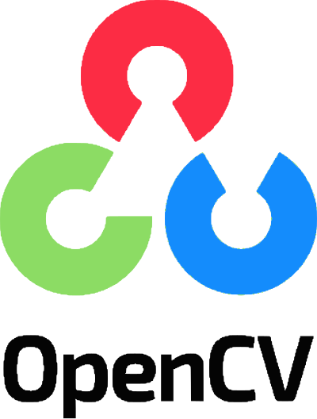
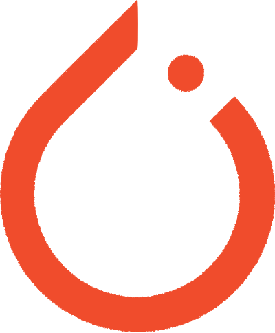
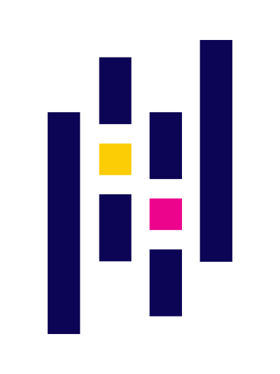

<h1 align="center">
  
</h1>

<h5 align="center">
  <code></code>
</h5>
 

  Hi, I'm Weston Salinas, Machine Learning / Computer Vision / Computer Engineer from Texas, USA
   
   
  🎓 I graduated with a Bachelors of Science from Texas Tech University, Department Computer Engineering
   
  🛩️ I have a passion for aerospace and robotics, and have worked professionally in both industries. 
   
  💻 I love writing code, learning new toolsets, and training machine learning models.
   
  💬 Ask me anything from <a href="https://github.com/westonCoder/westonCoder/issues" title="Issues">Here</a>

<h2 align="center">🔥 Languages & Tools 🔥</h2>
 

  <code></code>
  <code></code>
  <code></code>
  <code></code>
  <code></code>
  <code></code>
  <code></code>
  <code></code>
  <code></code>
  <code></code>
  <code></code>
  <code></code>
  <code></code>
  <code></code>
  <code></code>
  <code></code>
  <code></code>
  <code></code>

<h2 align="center">⚡ Stats ⚡</h2>
 

  

    
    
    
  

                

  
    

